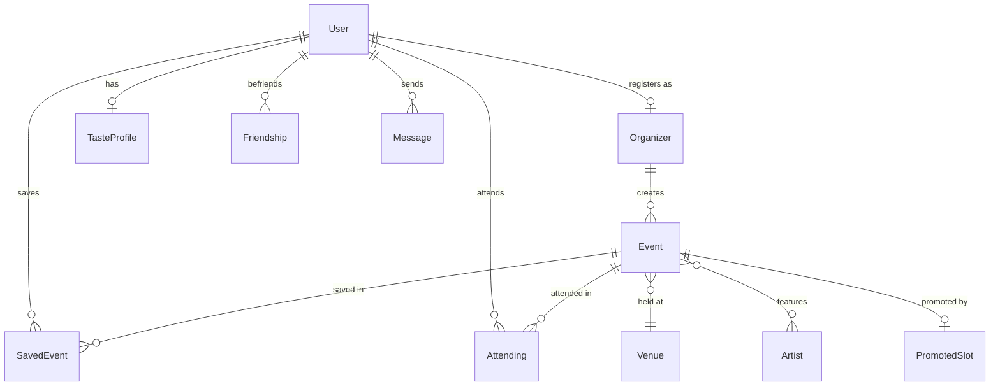

# Phase 1 Entities

- **User** — a person who browses, saves, and attends events.
- **Organizer** — a verified user who creates events.
- **Event** — a Sofia event listing.
- **Venue** — the physical location where an event is held.
- **Artist** — a performer featured at an event.
- **PromotedSlot** — a manually assigned promotion (slot 1 King of the Hive, slots 2–8 Buzz Spots).
- **SavedEvent** — a user's bookmark of an event.
- **Attending** — a user's intent to attend an event.
- **Friendship** — a connection between two users.
- **Message** — a message sent by a user.
- **TasteProfile** — a user's preferences used for recommendations.
